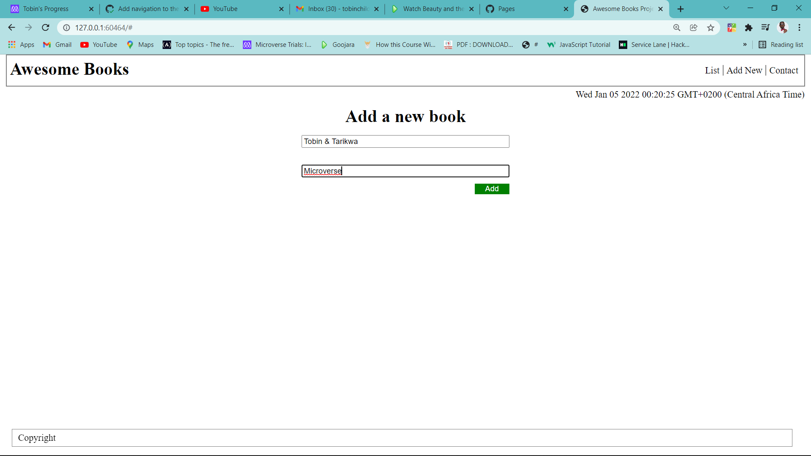
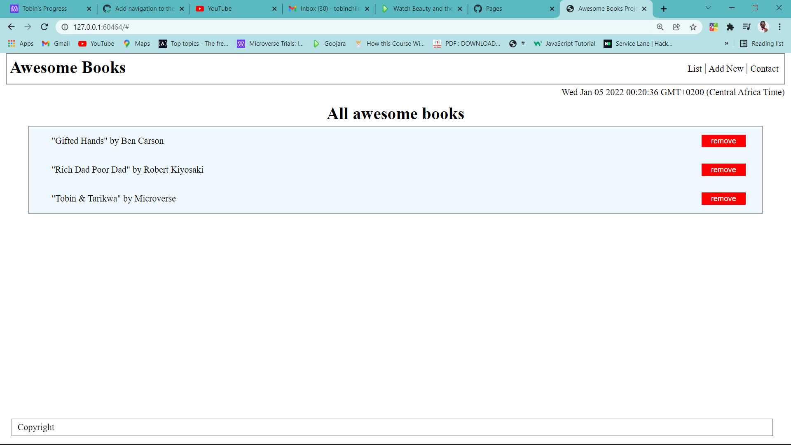

# Awesome Books

> Building Awesome-Books-project to review the things learned so as to show an understanding of all things learned.






## Live link
[Click here to see project](https://tobinchilongo.github.io/Awesome-Books/)


Additional description about the project and its features.

## Built With

- Major languages
- HTML
- JavaScript
- CSS


## Getting Started

**To get a copy of this repo into your local machine run the following command:**
```
git clone (https://github.com/Tobinchilongo/Awesome-books-ES6)
cd Awesome-books-ES6
in visual studio code you can click the go live button to view it live in the browser.
```

## Author

👤 **Tobin Chilongo Jnr**
👤 **Selma Belhadj**
👤 **Oybek Kayumov**


- GitHub: [@Tobinchilongo](https://github.com/Tobinchilongo)
GitHub: [@tariktesfa](https://github.com/tariktesfa)

## Show your support

Give a ⭐️ if you like this project!

## 📝 License

This project is [MIT](./MIT.md) licensed.
